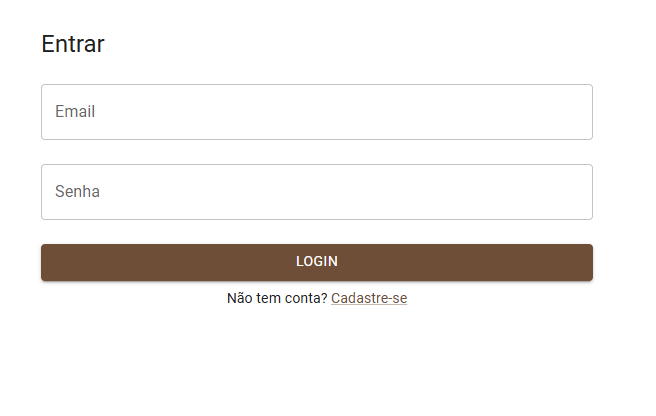
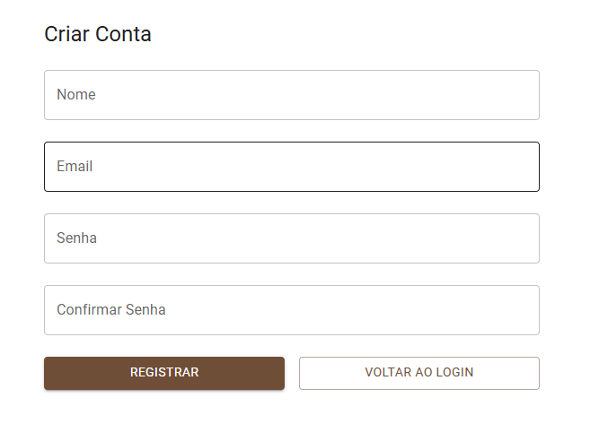
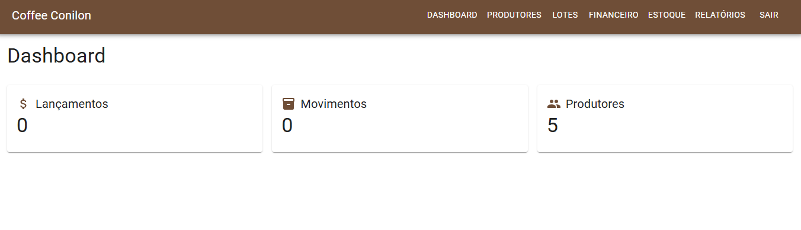
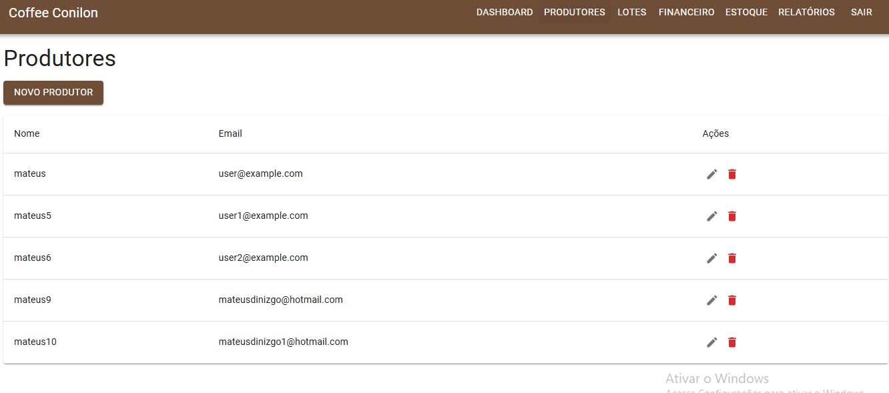

# Coffeeconilon-system

### **Tema**

O projeto final tem como tema o desenvolvimento de um sistema web chamado  *CoffeeConilon* , voltado à administração de propriedades agrícolas de café, incluindo controle de fazendas, talhões, safras, movimentações financeiras e estoque.

### **Escopo**

O repositório já implementa:

* Backend FastAPI com rotas para usuários, autenticação, propriedades (farms/lots/crops), lançamentos financeiros e controle de estoque.
* Serviços de relatório com resumo financeiro e de estoque.
* Frontend React com páginas de Login, Cadastro, Dashboard, Financeiro, Inventário, Relatórios e Produtores.
* Dockerfiles e `docker-compose.yml` para facilitar a execução.

### **Restrições**

* Algumas partes estão incompletas (vários itens do roadmap ainda marcados como pendentes).
* Testes automatizados em `backend/tests` estão vazios.

### **Protótipo**

Os protótipos das páginas principais (Login, Register, Dashboard, Financial, Inventory, Lots, Reports, Producers) foram criados no diretório `frontend/src/pages/`. A hierarquia do projeto é indicada no PDF “Detalhamento Estrutural Profundo do Projeto CoffeeConilon”, que explica a estrutura de pastas e responsabilidades de cada módulo.

#### Login



#### Registro



#### Dashboard



#### Produtores



#### Lotes


### **Referencia**

* [Detalhamento Estrutural Profundo do Projeto CoffeeConilon (PDF)](https://chatgpt.com/g/g-p-682cb3a24a548191a3308a01c4158e6f-sistema-web-1/c/Detalhamento%20Projeto.pdf)
* [FastAPI Documentation](https://fastapi.tiangolo.com/)
* [React Documentation](https://react.dev/)

---

## 🚀 Como Executar

### Backend (Python 3.11+)

```bash
pip install -r backend/requirements.txt
uvicorn app.main:app --reload
```

> Veja instruções detalhadas no `backend/Dockerfile`.

---

### Frontend (Node.js)

```bash
cd frontend
npm install
npm run build
```

* Para rodar localmente:
  ```bash
  npx serve dist
  ```

---

### Docker Compose (Backend + Frontend)

1. **Build e run:**
   ```bash
   docker compose up --build
   ```
2. **Acesso:**
   * API: [http://localhost:8000](http://localhost:8000/)
   * Web: [http://localhost:3000](http://localhost:3000/)

> Modificou o código?
>
> ```bash
> docker-compose build frontend # ou backend
> docker-compose up
> ```

---

### 💡 **Observações**

* Detalhes de portas e variáveis estão em `docker-compose.yml`
* Documentação da estrutura e responsabilidades em “Detalhamento Projeto.pdf”
