# Coffeeconilon-system

### **Tema**

O projeto final tem como tema o desenvolvimento de um sistema web chamado  *CoffeeConilon* , voltado à administração de propriedades agrícolas de café, incluindo controle de fazendas, talhões, safras, movimentações financeiras e estoque.

### **Escopo**

- Backend FastAPI com rotas para: usuários, autenticação, fazendas, lotes, safras, financeiro, estoque, relatórios e metadados.
- Relatórios com resumo financeiro (entradas, saídas, resultado) e estoque por produto (quantidade e unidade), com filtros por período, fazenda e lote.
- Frontend React com: Login, Cadastro, Dashboard, Financeiro, Inventário, Relatórios, Produtores, Assistente de Configuração.
- Dockerfiles e `docker-compose.yml` para subir a stack completa.

### **Restrições**

- Gestão avançada de estoque (multi‑depósito, lote/validade): o estoque é apenas quantitativo por produto.
- Visualmente não mostra o valor, data e lote na página, `http://localhost:3000/#/financial` ,porém é atualizado no banco de dados,dashboard e relatório.
- Visualmente não mostra quantidade, data e lote na página, `http://localhost:3000/#/inventory` , porém é atualizado no banco de dados, dashboard e relatório.
- Produção agrícola detalhada (ordens de serviço, insumos por talhão, apontamentos de campo): não implementado.
- Offline/PWA e sincronização móvel: o app é web online apenas.
- Não há níveis como admin/gerente/operador.

### **Protótipo**

Os protótipos das páginas principais (Login, Registro, Dashboard, Produtores, Fazenda, Lotes, Financeiro, Estoque, Relatório) foram criados no diretório `frontend/src/pages/`. A hierarquia do projeto é indicada no PDF “Detalhamento Projeto”, no diretório `docs/"Detalhamento do Projeto.pdf"/`que explica a estrutura de pastas e responsabilidades de cada módulo.

#### Login

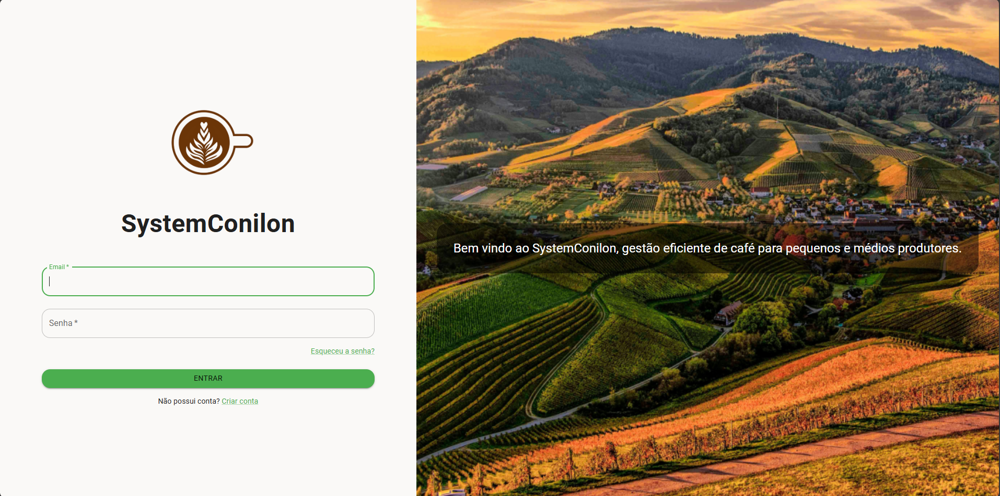

#### Registro

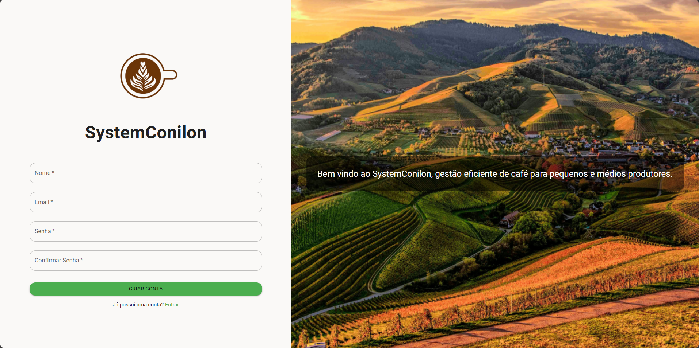

#### Tela Inicial

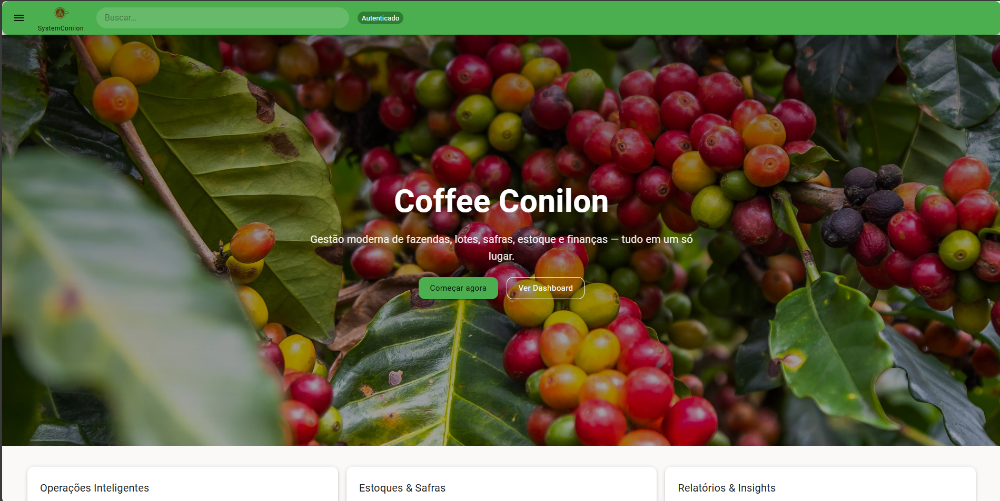

#### Dashboard

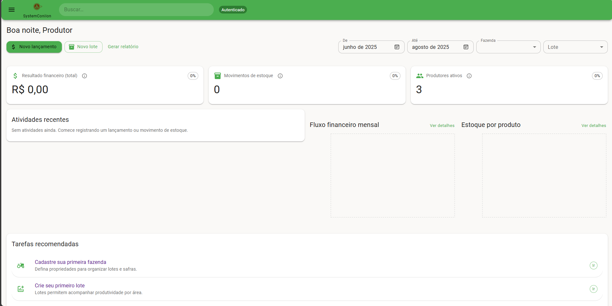

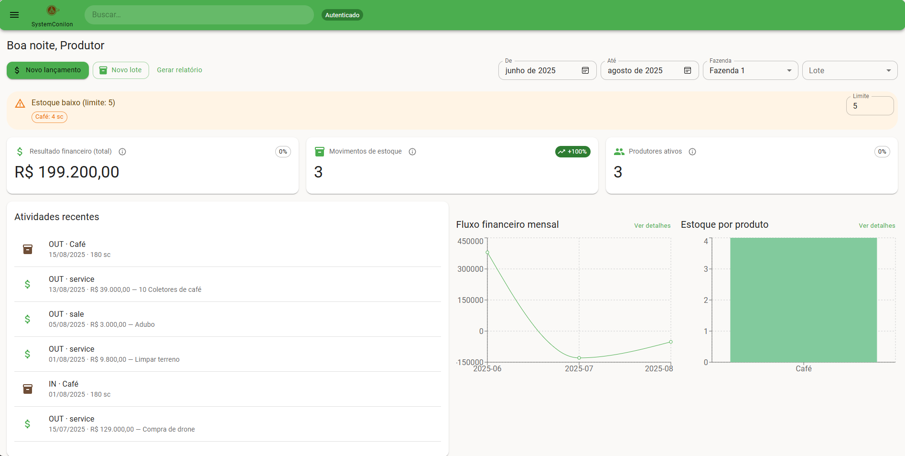

#### Produtores

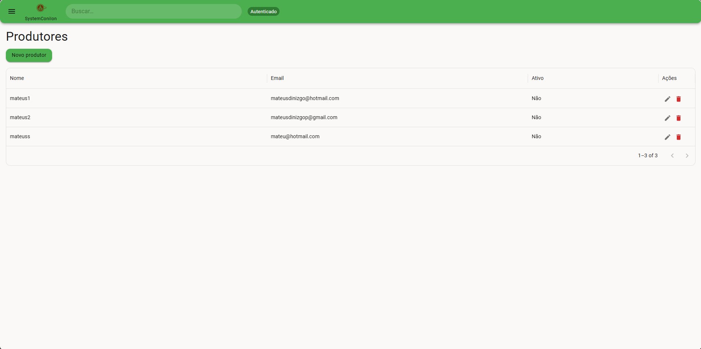

#### Fazenda

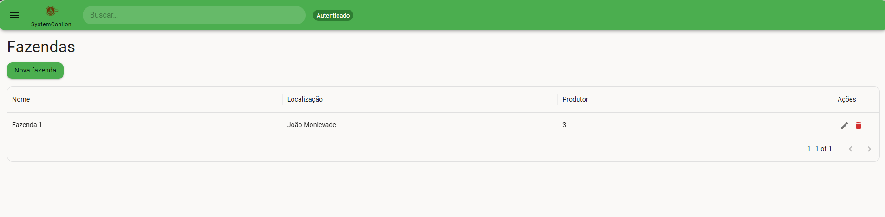

#### Lotes

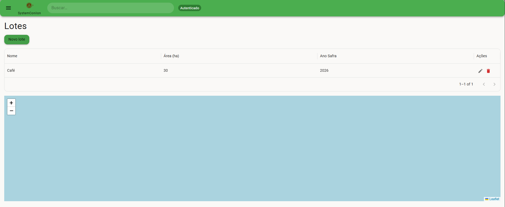

#### Financeiro

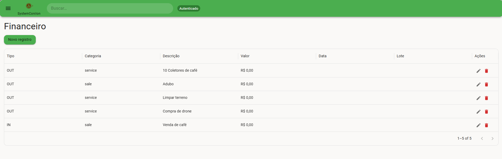

#### Estoque

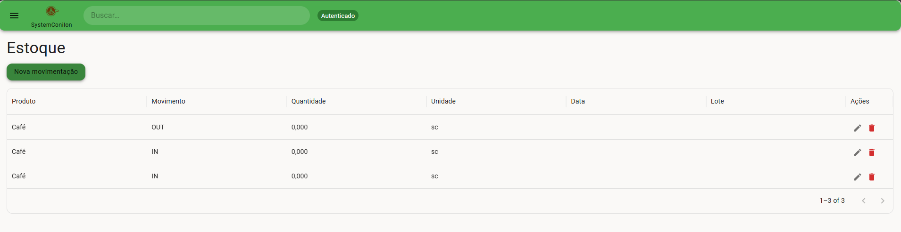

#### Relatório

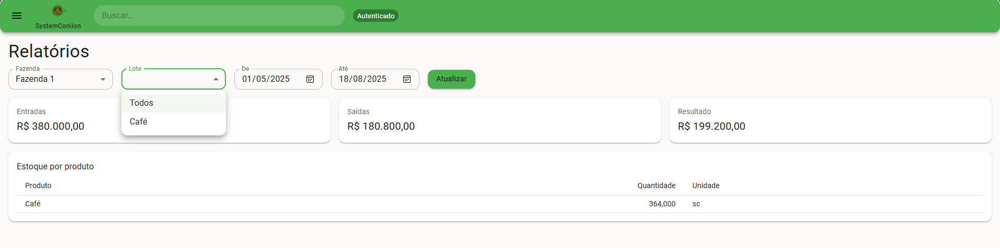

#### Banco de Dados(SQLite)

BD localizado em `backend\dev.db`

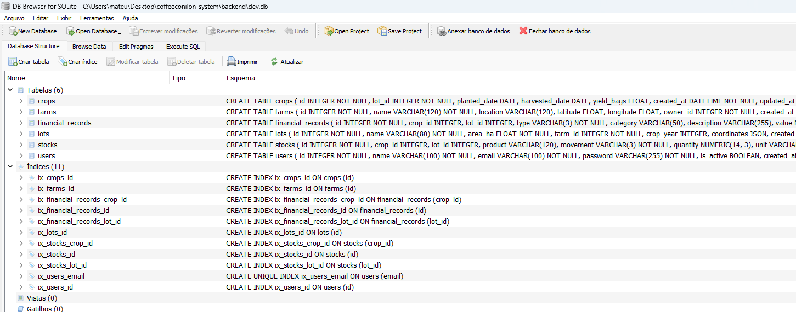

##### Users

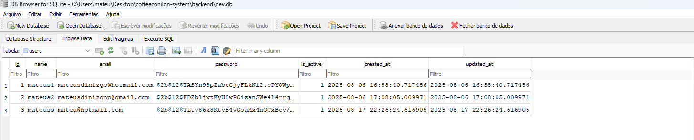

##### Stocks

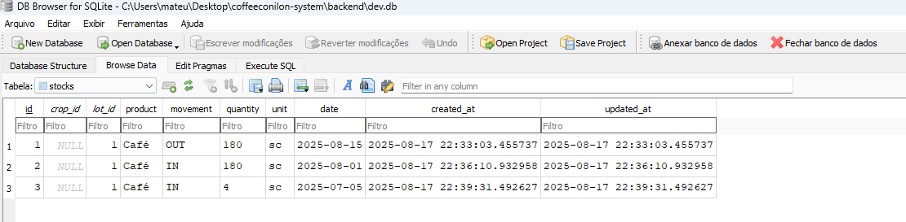

##### Crops

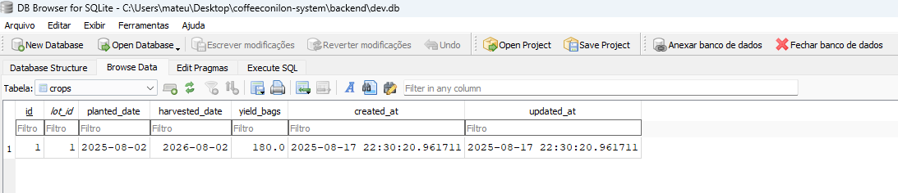

##### Farms

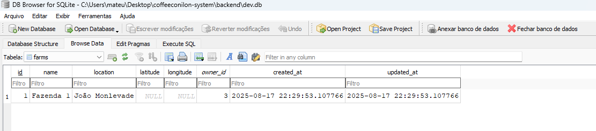

##### Financial

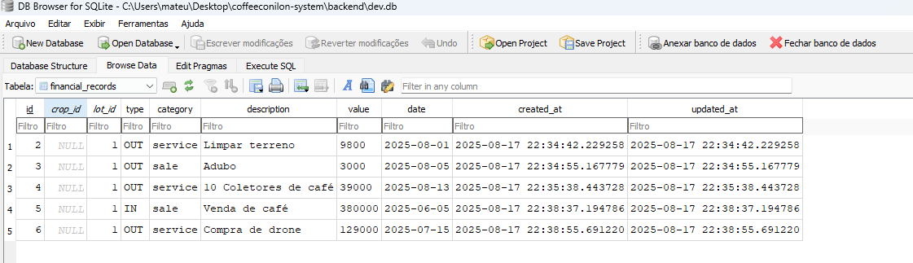

##### Lots

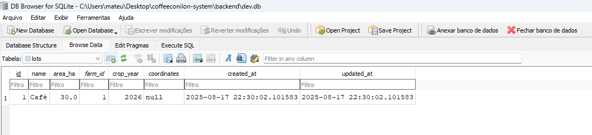


### **Referencia**

* [FastAPI Documentation](https://fastapi.tiangolo.com/)
* [React Documentation](https://react.dev/)

---

## 🚀 Como Executar

### Backend (Python 3.11+)

```bash
pip install -r backend/requirements.txt
uvicorn app.main:app --reload
```

> Veja instruções detalhadas no `backend/Dockerfile`.

---

### Frontend (Node.js)

```bash
cd frontend
npm install
npm run build
```

* Para rodar localmente:
  ```bash
  npx serve dist
  ```

---

### Docker Compose (Backend + Frontend)

1. **Build e run:**
   ```bash
   docker compose up --build
   ```
2. **Acesso:**
   * API: [http://localhost:8000](http://localhost:8000/)
   * Web: [http://localhost:3000](http://localhost:3000/)

> Modificou o código?
>
> ```bash
> docker-compose build frontend # ou backend
> docker-compose up
> ```

---

### 💡 **Observações**

* Detalhes de portas e variáveis estão em `docker-compose.yml`
